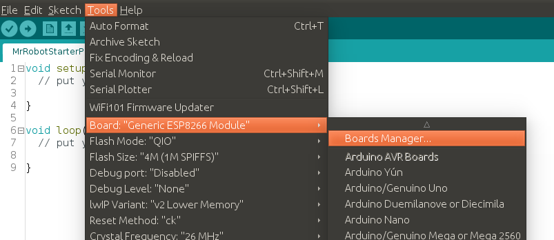

# MrRobotStarterPack
Mr. Robot Badge Firmware Starter Pack.

# Description of the Badge
# Arduino IDE Setup Instructions
* [Install a recent stock arduino IDE.](https://www.arduino.cc/en/Main/Software)
* Now we need to add ESP 8266 drivers to your IDE. To do this go Tools->Boards->BoardManager and a pop up should emerge.
  
  In the pop up search for `ESP8266` and install the board.
  

* Once you have installed te hardware package for the ESP8266 we can now add the software dependencies to the arduino IDE. To do this hit Sketch->Include Library->Manage Libraries and a dialog should pop up.
  
  * The first library we'll add is the Adafruit graphics library. We implement the Adafruit interface for rendering. In the dialog search for `Adafruit GFX` and install the library.
  
  * The second library we need is [Brzo](https://github.com/pasko-zh/brzo_i2c). Brzo is a fast I2C (eye-squared-see) interface written in assembly for ESP8266. It is much better than the built-in one for Arduino. We use it because our frame buffer is 324 bytes and the Arduino I2C library only let's you move 32 bytes at a time. This lets us send images to display as one big chunk. To install it search for `Brzo` in the library dialog.
  

# Image Tool Chain Setup
# Badge Flashing Instructions
  * Where to get a programmer.
  * How to program a badge.